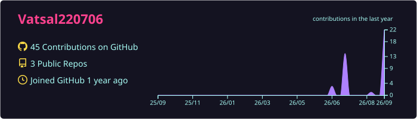
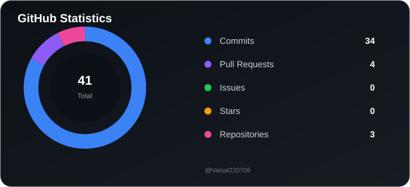
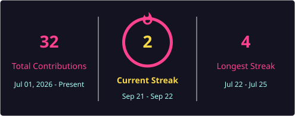

# 👋 Hi, I'm Vatsal Jaroli

### 💻 Frontend Engineer | 🎓 B.Tech CSE Student | 🤖 AI/ML Enthusiast

  

I'm a **3rd-year B.Tech Computer Science Engineering student** and a **Frontend Engineer** passionate about building practical, user-focused applications and continuously improving my problem-solving skills.

🔭 Currently working on **Spandan**, an **open-source project by IIT Ropar**.

🌱 Currently learning **DSA, Web Development, and AI/ML**.

---

## 🚀 Currently Working On

* 🔭 **Spandan** — Open-source project by **IIT Ropar**
* 🧠 Data Structures & Algorithms
* 🌐 Web Development
* 🤖 Artificial Intelligence & Machine Learning
* 💡 Problem Solving & Software Development

---

# 🛠️ Tech Stack

## 💻 Programming Languages

  &nbsp; &nbsp;
  &nbsp; &nbsp;
  &nbsp; &nbsp;
  &nbsp; &nbsp;
  &nbsp; &nbsp;

## 🎨 Frontend Development

  &nbsp; &nbsp;
  &nbsp; &nbsp;

## 🤖 AI / Machine Learning

  &nbsp; &nbsp;
  &nbsp; &nbsp;
  &nbsp; &nbsp;
  &nbsp; &nbsp;

## 🗄️ Databases

  &nbsp; &nbsp;
  &nbsp; &nbsp;

## ⚙️ Tools & Other

  &nbsp; &nbsp;
  &nbsp; &nbsp;
  &nbsp; &nbsp;

---

## 📚 Currently Learning

|      🧩 DSA     |    🌐 Web Development   |    🤖 AI / ML    | 🌍 Open Source |
| :-------------: | :---------------------: | :--------------: | :------------: |
| Problem Solving |   Frontend Development  | Machine Learning |  Contributions |
|    Algorithms   | Modern Web Technologies |  Computer Vision |  Collaboration |

---
<h2 align="center">📊 GitHub Statistics</h2>

  
  

  
  

---
<h2 align="center"> 🌐 Connect With Me</h2>
<!-- ## 🌐 Connect With Me -->

  
  &nbsp;
  
  
  &nbsp;
  
  

---

  💡 <i>Always learning. Always building. Always improving.</i>

  ⭐ Thanks for visiting my profile!

